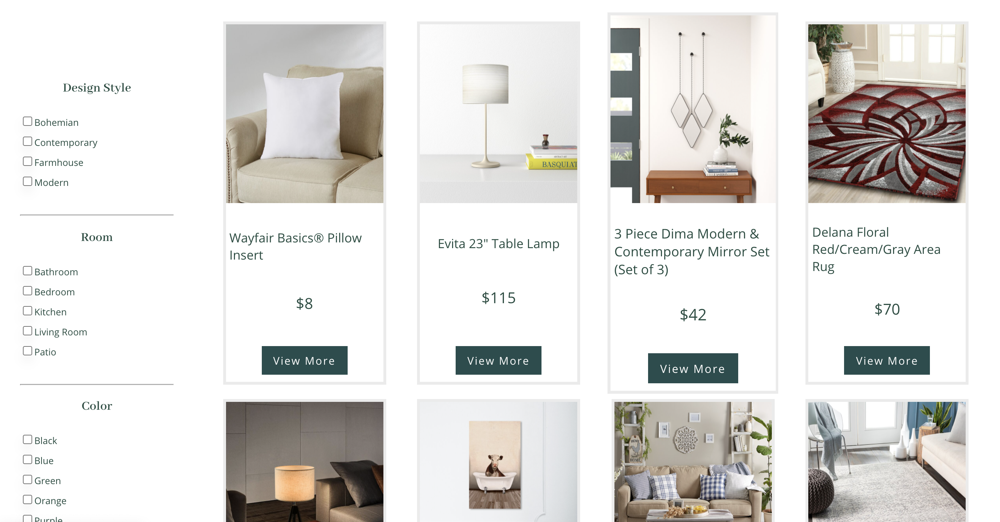
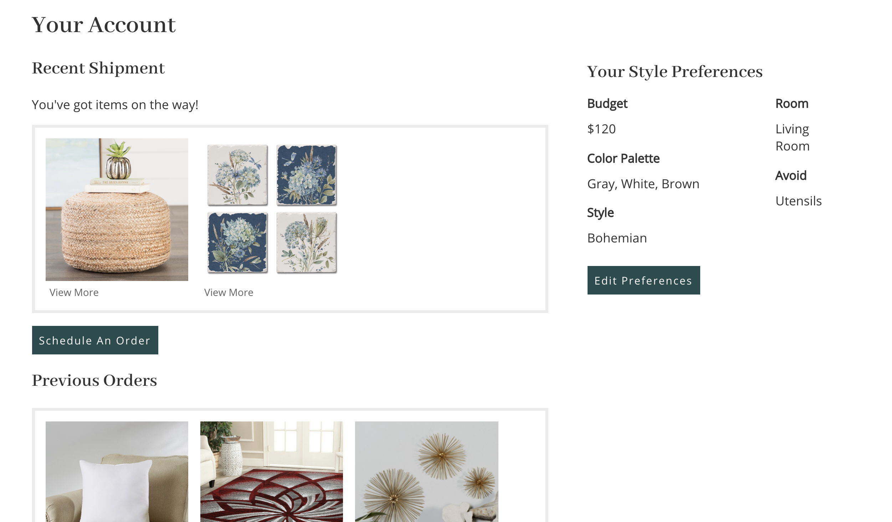

<h1 align= "center">
Interiorize
</h1>

<h2 align="center">Design Made Easy</h2>   
<p align="center">
  <a href="https://github.com/natelee3/interiorize-backend"><strong>Explore the Interiorize API Docs »</strong></a>
</p>
<p>
Active Development: 08/10/21 - 08/24/21
</p>
<p>
Interiorize was built for those who don’t have the knack or time to decorate their homes. Users are sent boxes of items based on their results from our style quiz. The style quiz asks users for their budget, what items they want us to avoid, and their room, style, and color preferences. Based on these responses, the Interiorize API will create the perfect interior design box for that user. Items can range from unique and quirky decor to beautiful art. Interiorize also offers a shop where users can browse through our inventory and purchase anything that captures their eye.
</p>
<p>
Make an account and get your personalized style box at <a href="https://interiorize.design/">Interiorize</a>!
</p>

## Demo

## Features
<ul>
<li><strong>Style Quiz - </strong>The quiz gathers style information from users and stores their answers in our database. Once the form is submitted an order is generated based on the user’s answers.</li>
<li><strong>User Profile - </strong>The user profile displays the most recent order along with the last three previous orders. Users can update their style preferences. These changes will update their preferences in our database.</li>
<li><strong>Shop - </strong>Users can shop for items generated by our API.</li>
<li><strong>Shop Filter - </strong>Items in the shop can be filtered based on multiple queries such as color, style preference, and budget.</li>
<li><strong>Item Details - </strong>Each item in the shop has an details page where the user can add the item to their cart </li>
<li><strong>Cart - </strong>Total cost is calculated based on items in the cart. Items can be added and removed from the cart. An order can be “placed” (order will appear on the user profile page). The cart icon is also updated based on whether it currently contains items or not.</li>
<li><strong>User Registration - </strong>Users can securely register and login through Auth0 </li>

</ul>

## Technologies
<ul>
<li>PostgreSQL</li>
<li>Express</li>
<li>React</li>
<li>Node.js</li>
</ul>

## Screenshots




## Code Examples
PostgreSQL query used to select all user quiz data to populate the user profile page.
``` javascript 
 static async getAllUserQuizData(user_id) {
        try {
            const response = await db.one(`
                SELECT user_id, budget, json_agg(json_build_array(color_one_id, color_two_id, color_three_id)) as colors, r1.color_name as color1, r2.color_name as color2, r3.color_name as color3, category_id, categories.category_name, style_id, tag_description as style_name 
                FROM quizzes
                INNER JOIN categories ON categories.id = category_id
                INNER JOIN tags ON tags.id = quizzes.style_id
                INNER JOIN colors as r1 ON r1.id = color_one_id
                INNER JOIN colors as r2 ON r2.id = color_two_id
                INNER JOIN colors as r3 ON r3.id = color_three_id
                WHERE user_id = ${user_id}
                GROUP BY user_id, budget, categories.category_name, quizzes.category_id, r1.color_name, r2.color_name, r3.color_name, tag_description, style_id; `
            )
            return response;
        } catch (error) {
            console.error('ERROR', error)
            return error
        }
    };
```
Sample of the generate order route and queries.
```javascript
router.post('/generate-order', checkJwt, async (req, res) => {
    console.log(req.body);
    const { user_id } = req.body;
    //GET all items
    const allItems = await ItemsModel.getAll();
    
    //GET quiz info
    const quizData = await QuizzesModel.getAllUserQuizData(user_id);
    const budget = quizData.budget;
    const category = quizData.category_name;
    const style_id = quizData.style_id;
    
    //GET user inventory
    const userInventory = await ItemsModel.getUserInventory(user_id);
    
    //GET avoid tags
    const avoidTagsReturn = await UsersModel.getUserAvoidStrings(user_id);
    const avoidTags = avoidTagsReturn[0].avoid_tags;

    //FILTER BY BUDGET & CATEGORY
    const filteredByBudget = allItems.filter(item => item.price < budget);
    
    //FILTER BY CATEGORY
    const filteredByBudgetCategory = filteredByBudget.filter(item => item.category_name === category);

    //FILTER BY STYLE TAG
    let filteredByBudgetCategoryStyle = [];
    filteredByBudgetCategory.forEach(item => {
        //If the tags of the item contain the style tag ID, add that item to the new list
        item.tag_ids.forEach(tag_id => {
            if(style_id === tag_id)
            {
                filteredByBudgetCategoryStyle.push(item);
            }
        });
    }); 
```
This route also takes into account user inventory and budget. The route results in a single order that matches the user's style preferences and contains items the user does not already have. Since our database is not extensive, there is a possibility that there are no items matching the quiz and inventory criteria. In that case, the user is directed to the shop.

## Process
<p>
Interiorize was designed to function similarly to the popular clothing subscription service, Stitch Fix. But without professional designers on our payroll, we needed to find a way to mock that personalized functionality with just software. To do that we created a mock database of 100 products gathered from Wayfair. These products were organized into a spreadsheet based on style (modern, farmhouse, contemporary, and bohemian) and room. Price, images, description, color, and brand were also collect from these items. This database is the core of Interiorize and allowed us to successfully mock the basic functionality of a personalized subscription service.
</p>
<p>View the spreadsheet <a href="https://docs.google.com/spreadsheets/d/1ru5krQQjEa66y6xwguIUm4_JMwNrWN1gAIL9b8eHNOk/edit?usp=sharing">here</a>.</p>
<p>Frontend design mockup can be viewed <a href="https://www.canva.com/design/DAEmu5jJqUg/tvbk3hckIqgr0xSnjSxYqQ/view?utm_content=DAEmu5jJqUg&utm_campaign=designshare&utm_medium=link&utm_source=sharebutton">here</a>.<p>

## Challenges
<p>
A big challenge for our group was working with a database of only 100 items. A bigger database of items would've allowed for us to create style boxes easier and more aligned with customer's style choices. At the moment, color preferences are stored, but not currently being used to filter items. A bigger database would've allowed us to filter items by color.  </p>
<p>
Working with our own API was both a challenge and an advantage. We could easily alter routes if we weren't getting the information we needed on the frontend, but some of the PostgreSQL queries eventually became long and complicated.</p>

## Goals
<ul>
<li><strong>Admin Dashboard -</strong> If Interiorize needed to be production ready for a business, it would need an admin dashboard. From the admin dashboard, employees would be able to see user's quiz results, recent transactions, and more. 
</li>
<li><strong>Reviews -</strong> Adding functionality for users to be able to review previous orders. Rather than displaying these reviews to the public, this information would go back to the "stylists" to better inform their decisions for the next box.</li>
<li><strong>Payment -</strong> During our two weeks of active development, we were not able to implement any sort of mock payment setup. Adding a payment page would have been the final touch to the ecommerce portion of the project.</li>
</ul>

## Contributors
<a href="https://github.com/sarahdepalo">Sarah dePalo</a> - Technical writer, user profile and style quiz design and functionality. Shopping cart calculations and item removal
</br>
<a href="https://github.com/zach-a-g">Zach Gleeson</a> - Homepage, shop intro, item details, and shopping cart design and functionality
</br>
<a href="https://github.com/logancooper">Logan Cooper</a> - Project manager, seeding and setup of database, setup of generateOrder and shopSearch routes
</br>
<a href="https://github.com/natelee3">Nate Lee</a> - Creating and securing API, frontend and backend deployment, auth0 integration, API docs
</br>
</br>
<p>Don't forget to checkout the <a href="https://github.com/natelee3/interiorize-backend">backend code</a> and the API! </p>

